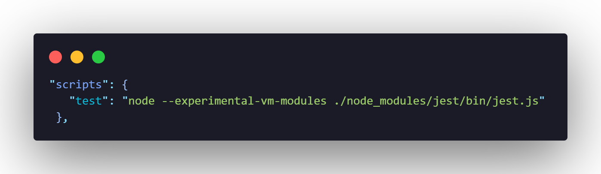
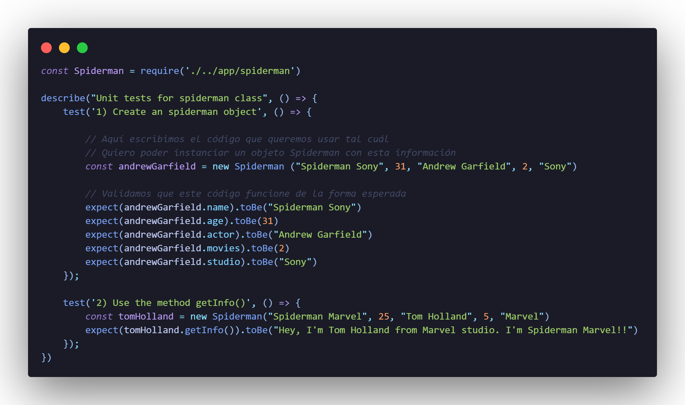
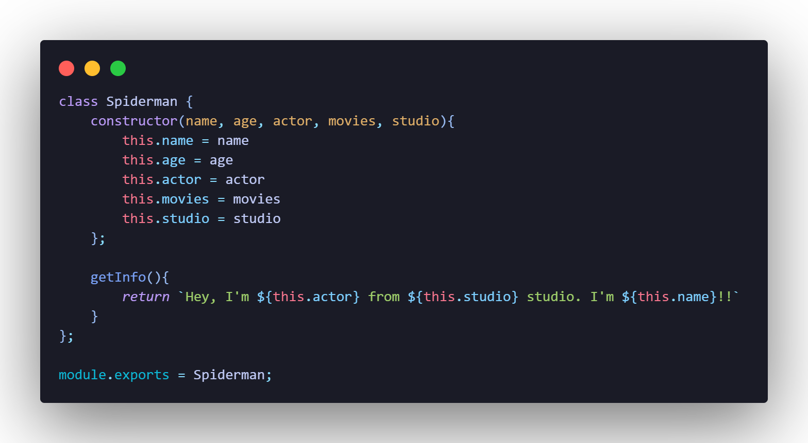

# Diseño de software con TDD

TDD o Test-Drive Development (Desarrollo Dirigido por Tests), es una práctica de programación que consiste en escribir primero las pruebas (generalmente unitarias), después de escribir el código fuente que pase la prueba satisfactoriamente y, por último, refactorizar el código escrito.

A continuación se ennumeran los pasos a seguir:
1. Creación de un nuevo proyecto.
2. Agregando una prueba de unidad vacía.
3. Test Driven Development by Martin Fowler.

## l Creación de un nuevo proyecto.
Una vez creado la carpeta que contendrá el proyecto se realizan los pasos siguientes:
* Ejecuta ``npm init``para crear el archivo package.json.
* Ejecuta ``npm install --save-dev jest`` para agregar jest.
* Modifica el archivo **package.json**, para al ejecutar el comando ```npm test``se pueda ejecutar jest.



Por último, se crean las carpetas **app** y **test**, y el archivo raíz **index.js**

## ll Agregando una prueba de unidad vacía.
En la carpeta test se agrega un archivo con el nombre **spiderman.test.js** y dentro se escribe una prueba de unidad en jest.

```
describe("Test Suite Dummy Description", () =>{
    test('Case 1 Dummy' () => {
        const resulOfSomething = 1 + 2;
        expect(resulOfSomething).toBe(18);
    });
})
```

Para correr el código de la prueba se utiliza el siguiente comando:
**npm test test/spiderman.test.js**

Por inercia, esta prueba devolverá un error ya que hemos puesto que como resultado esperado sea un 18, pero lógicamente el resultado de la operación será un 3.

## lll Test Driven Development by Martin Fowler

TDD Design Software Technique

1. Write a test for the next bit of functionality you want to add.
2. Write the functional code until the test passes.
3. Refactor both new and old code to make it well structured.

Referencia: [TDD by Martin Fowler](https://martinfowler.com/bliki/TestDrivenDevelopment.html)

**Para esta parte se utilizarán las técnicas de TDD.**

Se modificará la prueba que anteriormente se ha realizado por los requerimientos solicitados:

*Requerimientos:*
* Crea una clase spiderman que tenga como atributos los siguientes campos: nombre, edad, actor que lo interpretó, número de películas en las que apareció, estudio de cine.
* Queremos usar un método que nos regrese la siguiente información: nombre y estudio al que pertenece el spiderman instanciado.

    Ejemplo:

    tomHolland.getInfo() // esto necesita regresar: "Hey, I'm Tom Holland from Marvel studio"


En esta parte la prueba se ha modificado en base a los requerimientos solicitados, por lo cuál se ha creado el test 1 y el test 2. Tambíen se ha importado la clase Spiderman, pero que aun no ha sido creada.




En el directorio app se crea un archivo llamado **spiderman.js** y se debe escribir la clase Spiderman, dentro de la clase se agrega un constructor y se guarda el atributo name, age, actor, movies, studio. También se agrega un método denominado getInfo en base al requerimiento 2. Por último, exportamos la clase.



Al final se vuelve a correr la prueba consiguiendo haber pasado todos los casos.


